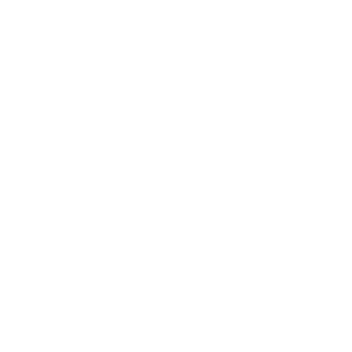

# **SelfCrypt**

  
*A secure, self-built password manager for those who value privacy.*

## 📜 **Overview**
SelfCrypt is a lightweight, private password manager designed for personal use. It focuses on **security and user control** by generating 100-character long passwords and encrypting them with **bcrypt**. Users must build the program themselves from this repository to ensure transparency and trust.

## 🛡️ **Key Features**
- **100-character password generation** using cryptographically secure methods.
- **bcrypt encryption** to securely store passwords.
- **Minimal UI** with a splash screen and dark-themed welcome interface.
- Designed to be **self-hosted** for maximum privacy.

## 📂 **Project Structure**
```
SelfCrypt/
│
├── favicon.png        # Project logo
├── README.md          # Project documentation
├── main.py            # Main script with splash screen and UI
├── backend.py         # Backend logic for password generation and encryption
└── requirements.txt   # List of dependencies
```

## 🛠️ **Installation & Setup**
1. **Clone the repository:**
   ```bash
   git clone https://github.com/YOUR-USERNAME/SelfCrypt.git
   cd SelfCrypt
   ```

2. **Install dependencies:**
   ```bash
   pip install -r requirements.txt
   ```

3. **Run the application:**
   ```bash
   python main.py
   ```

## 🚀 **How It Works**
1. **Splash Screen:**  
   - The SelfCrypt logo appears on launch for a few seconds.  
2. **Welcome Screen:**  
   - Users are greeted with a simple interface to **generate** passwords or **view stored passwords**.

3. **Password Storage:**  
   - Passwords are **encrypted using bcrypt** and stored locally in a SQLite database.

## 🎨 **Future Features**
- Master key setup for enhanced security.
- Ability to export/import passwords.
- User-configurable password settings.

## 🧑‍💻 **Contributing**
Feel free to open issues or submit pull requests if you have suggestions or improvements!

## ⚠️ **Security Notice**
- This program is designed for **personal use only**.  
- Always build the program yourself to ensure the integrity of the code.

## 📄 **License**
This project is licensed under the [MIT License](LICENSE).
